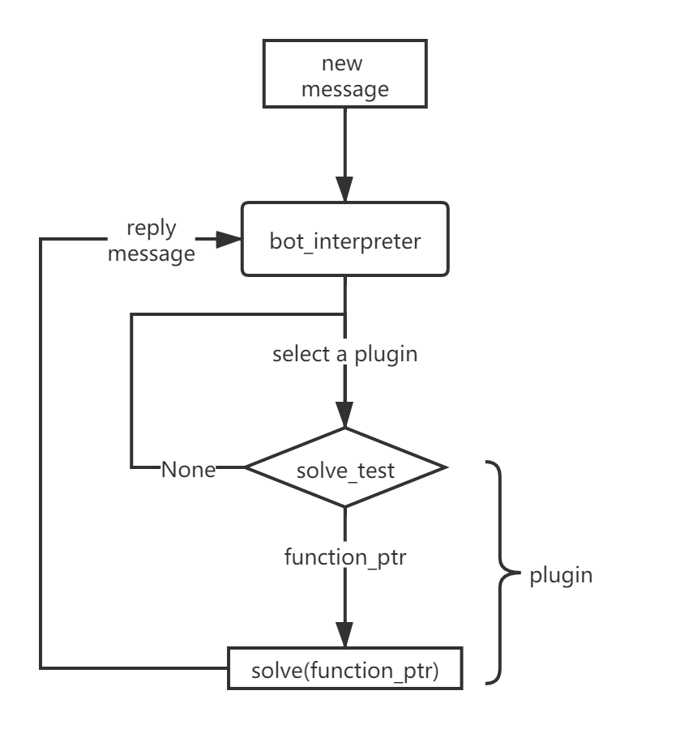

# Plugin

这部分内容以plugin/chainGuard/chain_guard.py作一个简单的说明



---

#### Plugin协议

每个plugin都要遵循的协议, bot_interpreter将通过以下接口调用plugin的方法

##### solve_test(msg: QQMessage):

> 判断plugin能否响应msg, 返回值为响应函数或为None
>
> ```python
> # 示例
> def query_chain_simple(msg):
>    	...
> def query_chain_detail(msg):
>    	...
> 
> [prefix_]commands = {
>  	'查询': query_chain_simple,
>  	'状态': query_chain_detail
> }
> def solve_test(msg: QQMessage):
>  	command = msg.message
>  	return [prefix_]commands.get(command)
> ```

#### solve(msg: QQMessage):
> 根据msg响应对应的函数
> ```python
> def solve(msg: QQMessage):
> 	if solve_test(msg):
> 		# 建议异步调用方法, 避免阻塞bot
> 		thread = threading.Thread(target=solve_test(msg), args=(msg,))
> 		thread.start()
> ```

#### solve_description() -> dict:


>返回plugin的说明字典
>
>```python
># 描述plugin说明的字典, 原则上key应该与[prefix_]commands中的key一一对应
>[prefix_]commands_description = {
>    	'查询': '返回简单的chain状态',
>    	'状态': '返回详细的chain状态',
>}
>
>def solve_description():
>    	return [prefix_]commands_description
>```
